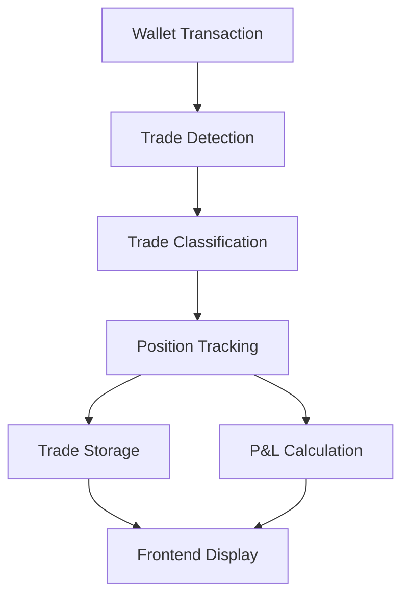

# Sol Trade Tracking System

## Overview
A comprehensive system for tracking cryptocurrency trades on the Solana blockchain, featuring real-time trade monitoring, position tracking, and trade lifecycle management.

## System Architecture

### Backend Components

#### Trade Tracking Manager (`tracking_manager.py`)
- **Core Trade Management**
  - Tracks active and closed trades
  - Manages trade lifecycle (open → partial close → full close)
  - Handles FIFO accounting for trade matching
  - Maintains trade history and position sizes

- **Data Storage**
  ```
  /Backend
  ├── tracked_trades.json    # Active and historical trades
  ├── closed_trades.json     # Completed trade records
  └── open_trades.json       # Currently open positions
  ```

#### Wallet Tracking (`wallet_tracking.py`)
- Real-time monitoring of wallet transactions
- Trade detection and classification
- WebSocket integration for live updates
- Price tracking and profit calculations

### Frontend Components

#### Trade Types (`types/trades.ts`)
```typescript
interface Trade {
  signature: string;
  type: 'buy' | 'sell';
  tokenAddress: string;
  value: string;
  timestamp: number;
  html: string;
  profit?: number;
  amount?: number;
  entryPrice?: number;
  currentPrice?: number;
}

interface TrackedTrade {
  id: string;
  date_time: string;
  token_address: string;
  buy_price: number;
  status: 'active' | 'partial' | 'closed';
  profit: number;
  profit_percentage: number;
  token_amount: number;
  partial_sales?: Array<{
    amount: number;
    price: number;
    date_time: string;
    transaction_link?: string;
    profit?: number;
    profit_percentage?: number;
  }>;
}
```

#### Active Trades Display (`components/Dashboard/ActiveTrades.tsx`)
- Real-time trade monitoring dashboard
- Filtering by trade status (active/closed)
- Profit/loss tracking
- Partial sale history

## Trade Lifecycle

1. **Trade Detection**
   ```python
   # wallet_tracking.py
   async def handle_trade(trade):
     # Process new trade
     # Calculate initial metrics
     # Store in tracking system
   ```

2. **Trade Tracking**
   ```python
   # tracking_manager.py
   def add_tracked_trade():
     # Add new trade to tracking
     # Update position sizes
     # Save to tracked_trades.json
   ```

3. **Position Updates**
   ```python
   def update_position():
     # Update current position
     # Track partial sales
     # Calculate running P&L
   ```

4. **Trade Closure**
   ```python
   def close_tracked_trade():
     # Match trades using FIFO
     # Calculate final P&L
     # Move to closed_trades.json
   ```

## Data Flow



## Development Focus Areas

### Current Features
- Real-time trade tracking
- FIFO trade matching
- Partial sale support
- P&L calculations
- Position size tracking

### Needed Improvements
1. **Trade Storage**
   - Implement better error handling for file operations
   - Add data validation before storage
   - Implement backup system

2. **Trade Tracking**
   - Add support for multiple wallet groups
   - Improve partial sale matching
   - Add trade tags and categories

3. **Frontend Updates**
   - Fix type definitions for tracked trades
   - Add real-time position updates
   - Implement better error handling

4. **Data Integrity**
   - Add verification for saved trades
   - Implement trade reconciliation
   - Add data recovery mechanisms

## Getting Started

1. **Setup Backend**
   ```bash
   cd Backend
   pip install -r requirements.txt
   python wallet_tracking.py --wallet YOUR_WALLET_ADDRESS
   ```

2. **Setup Frontend**
   ```bash
   npm install
   npm run dev
   ```

## Configuration

Create a `.env` file:
```env
HELIUS_API_KEY=your_api_key
WEBSOCKET_PORT=8000
```

## Contributing

1. Fork the repository
2. Create your feature branch
3. Commit your changes
4. Push to the branch
5. Create a Pull Request

## Testing

Run the test suite:
```bash
python -m pytest Backend/test_trade_lifecycle.py
``` 